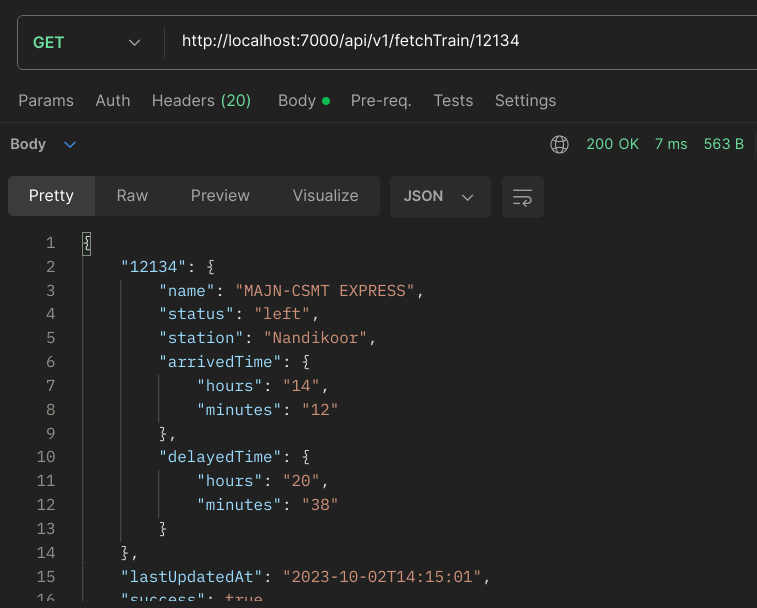
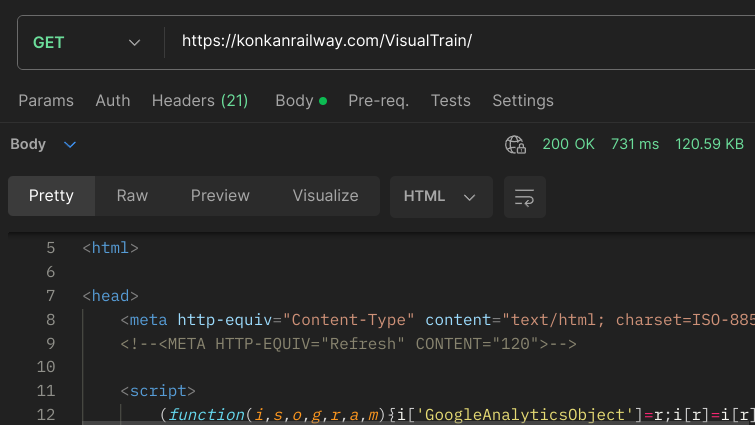

# konkan-railway_train-position

This API scrapes the [Konkan Railway Current Train Position](https://konkanrailway.com/VisualTrain/) website, converts the essential data into JSON and uses it to serve the various endpoints.

Based on [sibi361/konkan-railway_api](https://github.com/sibi361/konkan-railway_api).

## Available Endpoints

All endpoints return JSON and serve at http://localhost:3000/api/v2/ by default.

- `/api/fetchTrains/`
    Returns live status about all the trains currently moving on the Konkan Railway

    Appending `?latest` to the URL will trigger a manual update from the upstream

- `/api/fetchTrain/<TRAIN-NUMBER>`
    Returns an object containing information about the queried train such as
        - most recently touched station
        - arrived/departed time from that station
        - delay time i.e. whether the train is late or not

    Appending `?latest` to the URL will trigger a manual update from the upstream

- `/api/fetchStations/`
    Returns an object containing all the stations on the Konkan Railway route

- `/api/fetchStation/<STATION-PLACE-NAME>`
     Returns an object containing information about the queried station such as
        - type i.e. big station or small station
        - state
        - description

## TODO

- [ ] Build a frontend
- [ ] Implement rate limiting
- [ ] Send PR to [public-api-lists](https://github.com/public-api-lists/public-api-lists) after hosting on a stable cloud as azure keeps suspending this API since it's currently running on free tier

## Motivation

Due to poor network connectivity near most railway stations and during transit, the Current Train Position site with a size of ~250KB would take a long time to load.

When deployed on a cloud server, this API can instantly fetch the upstream site and send the required information to the client, consuming well under 1KB, hence leaving no chance for lag.

~550 Bytes versus ~120KB, that too without the assets

## Legal

This project is in no way affiliated or related to any railway or other company/organization, for e.g. Indian Railways. It is a completely independent and not-for-profit API built for educational purposes only.
